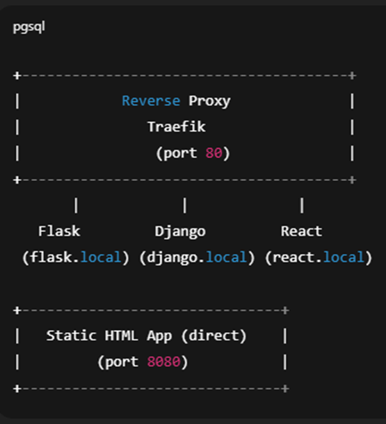
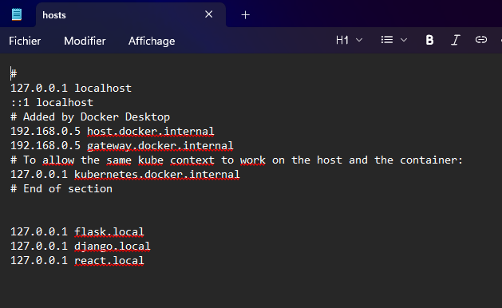
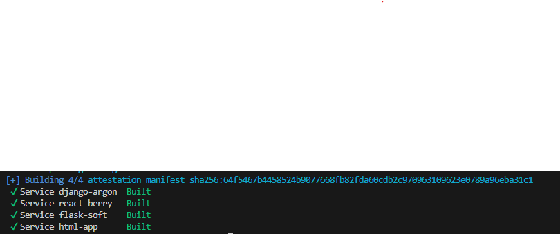
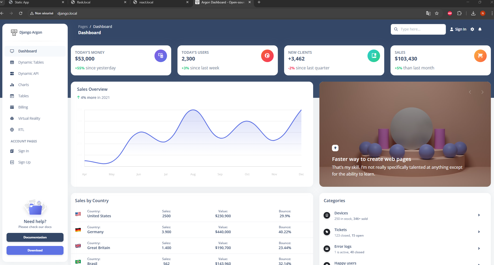
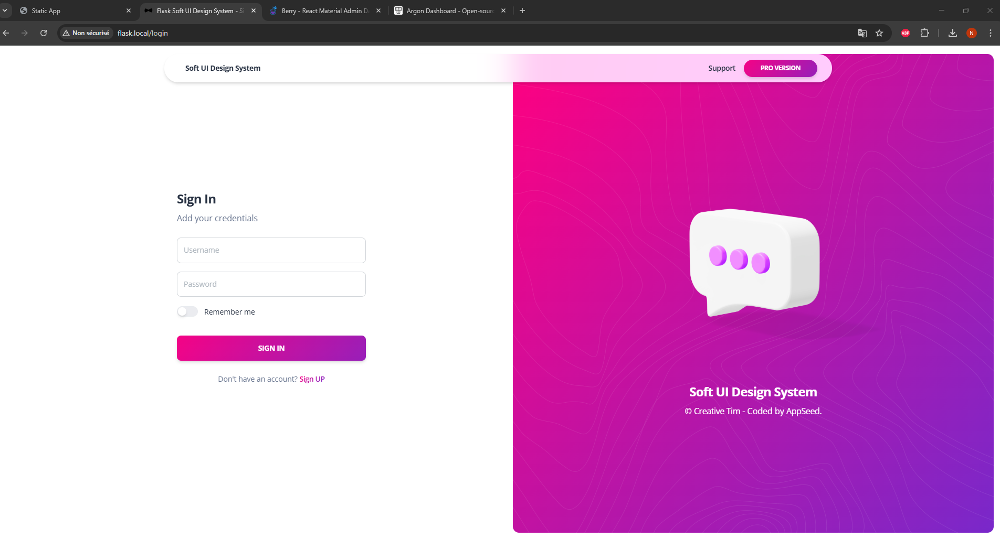
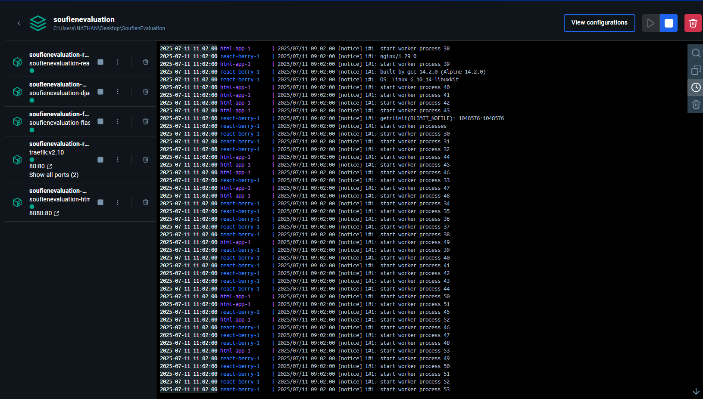
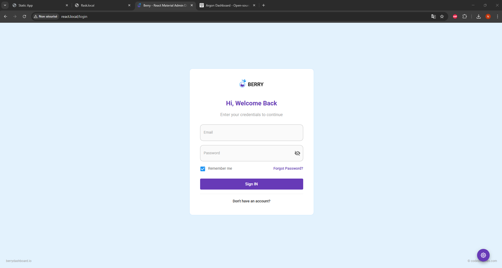
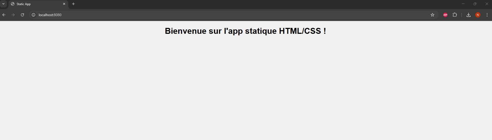

# Projet Docker DevSecOps
Composition de l'équipe : 
- Nathan Shoepps
- Huong Thomas
- Jean-Loick Quashie
- Adrien Wargnier
- Nolan Gabriel Nabeth
## Objectif du projet
Mettre en oeuvre un environnement conteneurisé complet avec 4 applications distinctes, orchestrées via docker et sécurisées via un reverse-proxy.

### Choix des frameworks et technologies
Nous avons choisi d'utiliser 4 technologies différentes, dont 3 framework javascript :
- Flask
- Django
- React
Ainsi qu'une application html css statique

### Répartition des tâches
L'équipe étant composée de 5 personnes, chaque personne s'est occupée d'écrire le dockerfile de chaque projet, tandis que la dernière (Nathan) a écrit le docker-compose et a envoyé les projets sur son git.

## Architecture du projet

### Arborescence
SOUFIENEVALUATION/  
├── django-argon/  
├── flask-soft-design/  
├── html-app/  
├── images/  
├── react-berry/  
├── docker-compose.yaml  
└── README


### Schéma du reverse-proxy


## Démarche

### Etape 1 : Choix des images et création des dockerfile

Après une courte durée de réflexion nous avons parcouru le lien appgenerator et avons choisi les applications à déployer.

Nous avons ensuite généré les dockerfile chacun de notre côté et avons fait en sorte qu'ils fonctionnent au moins en local.

Commandes utilisées :
```bash
docker build -t [application] # construire image
docker run -d -p [port_hote]:[port_conteneur] # lancer image
docker ps # afficher conteneurs qui tournent
docker ps -a # afficher tous les conteneurs même ceux qui tournent pas
docker stop [id_conteneur] # arrêter un conteneur
```

### Etape 2 : Envoi des dockerfile à Nathan et création du docker compose

Une fois les dockerfile générés nous les avons partagés à Nathan qui s'est donc occupé de générer le docker-compose en implémentant le reverse-proxy

Nous avons vérifié que cela marchait bien sur son pc en local et sommes passés à l'étape suivante.

Commandes utilisées :
```bash
docker-compose build # construire les images avec le docker-compose
docker-compose up # lancer les conteneurs
docker-compose down # arrêter les conteneurs
```

### Etape 3 : Optimisation de la taille des images, tests finaux et création du git

Nous avons utilisé des images plus légères qu'à l'origine (images slim) pour optimiser le docker, et après les derniers tests pour s'assurer que tout allait bien, nous avons tout envoyé sur le dockerhub.

Et enfin nous avons mis le projet dans un git, créé par Nathan.

[Lien git](https://github.com/NathanSchoepps/SoufienEvaluation#)  
[Lien dockerhub](https://hub.docker.com/u/leprimito)

### Etape 4 : Rédaction du document de rapport du projet

Après avoir fini le travail nous avons rédigé le document (celui que vous lisez) pour finir le rendu.

## Difficultés et captures d'écran

Au début les images étaient inaccessibles et nous avons du mettre à jour le fichier hosts :


Voici pour finir quelques captures d'écrans pour montrer ce que nous avons fait et compléter notre rendu en plus du git et du dockerhub






